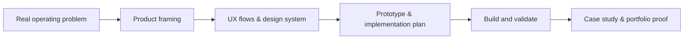
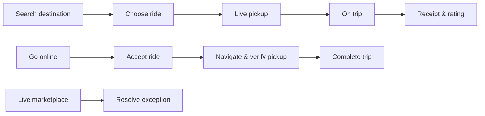

# Saimon Kabir Chowdhury — Portfolio


Personal portfolio for **Saimon Kabir Chowdhury** — a product-minded developer working across mobile apps, operational software, AI and computer vision.

## Live concept

The site is a static, fast portfolio landing page with scroll reveals, animated product mockups and a repeatable case-study structure. Open [index.html](index.html) locally to view it.

## Portfolio workflow



## Featured work

### SwiftRide — map-first ride-sharing system

The flagship case study shows a full rider, driver and operations loop:



Designed states include:

- Rider map, search, fare choice, booking, live pickup, safety, payment and activity
- Driver availability, incoming offer, GPS navigation, pickup PIN, earnings and vehicle profile
- Operations dispatch, supply/demand map, exception handling and assignment

The editable UX/UI work lives in the Penpot project **SwiftRide — Product & UX**.

## Other portfolio tracks

| Project | Area | Purpose |
| --- | --- | --- |
| SwiftRide | Real-time mobility | Ride-sharing for riders, drivers and operations |
| VisionInspect | Computer vision | Visual quality decisions from camera input |
| TableFlow | Hospitality operations | Reservations and floor management with live state |
| Future systems | AI + product | Practical automation for SMEs |

## Project structure

```text
.
├── index.html        # Portfolio page
├── styles.css        # Visual system, mockups, responsive layout
└── script.js         # Scroll-reveal and smooth-navigation behavior
```

## Local use

No dependencies or build process are required. Open `index.html` in a browser.

## Honest portfolio note

SwiftRide is a self-initiated product concept. It is presented as design and implementation-ready product work until a production build is complete.
