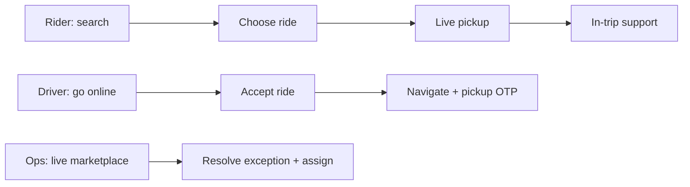
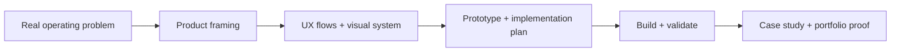

# Saimon Kabir Chowdhury — Portfolio Domain


A cinematic personal portfolio for **Saimon Kabir Chowdhury** — a product-minded builder working across mobile experiences, AI, computer vision and operational software.

The page uses a deep-navy visual system, custom hero illustration, dimensional CSS interfaces, motion, pointer-driven depth and a lightweight particle field. It needs no framework or build step: open [index.html](index.html) in a browser.

## Featured case study: SwiftRide

The portfolio links to a standalone [SwiftRide case study](swiftride.html). It includes rider, driver and operations UI/UX, flow rationale and design-system decisions.

SwiftRide is a map-first ride-sharing ecosystem designed for three roles sharing one live marketplace.

| Role | Product moment | Screen represented on the site |
| --- | --- | --- |
| Rider | Find the destination | Destination search |
| Rider | Make the booking decision | Ride selection |
| Rider | Know where the driver is | Live pickup map |
| Rider | Stay informed and safe | In-trip controls |
| Driver | Complete the pickup reliably | Navigation + pickup OTP |
| Operations | Protect service levels | Live marketplace dispatch |



The editable UX/UI source remains in the Penpot project **SwiftRide — Product & UX**. The website’s screens are purpose-built browser presentations of that rider, driver and operations flow; SwiftRide is a self-initiated, implementation-ready concept until a production build is published.

## Project archive

[`projects/`](projects/) contains 20 numbered product folders. Every folder has a short product brief and is deliberately ready to receive its own source code, documentation, assets and deployment configuration.

```text
projects/
  01-swiftride/       06-fixfleet/         11-caretrack/        16-leadboard/
  02-tableflow/       07-invoicepilot/     12-menumint/         17-gympulse/
  03-sitesight/       08-rentready/        13-shiftsync/        18-tutormatch/
  04-queueless/       09-classloop/        14-claimsnap/        19-parcelproof/
  05-stocklens/       10-eventpulse/       15-vendorvault/      20-visioninspect/
```

## Portfolio workflow



## Repository layout

```text
.
├── assets/            # Hero art and future portfolio assets
├── projects/          # 20 code-ready product spaces
├── index.html         # Portfolio experience and case study
├── swiftride.html     # Dedicated SwiftRide product case study
├── styles.css         # 3D visual system and responsive screens
├── theme.css          # Deep-navy theme, AI/ML and case-study layout
├── script.js          # Motion, reveals, depth and particle field
└── README.md
```
